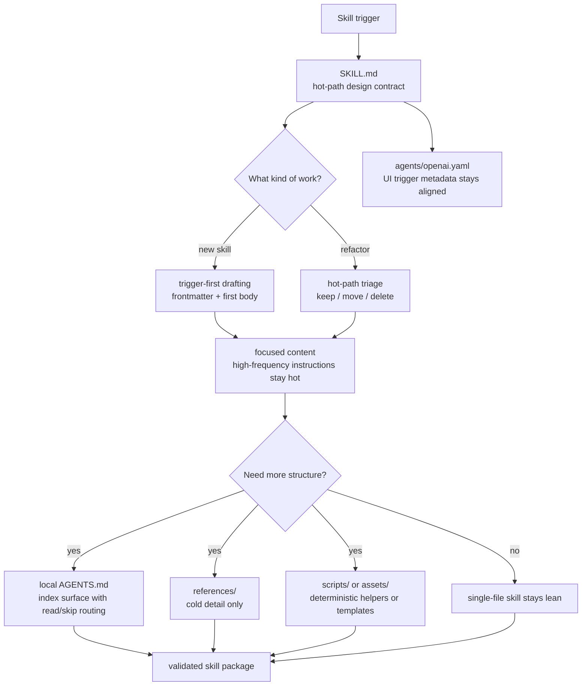

# Skill Write Refactor

[中文说明](./README.zh-CN.md)

This repository packages a reusable Codex skill for creating new skills and refactoring existing ones without letting `SKILL.md` turn into an unfocused catch-all document. The design keeps the hot path readable, routes colder detail outward only when it earns its cost, and treats structure as part of runtime behavior rather than documentation polish.

## Architecture



## Repository Layout

```text
skill-write-refactor/
  README.md
  README.zh-CN.md
  LICENSE
  .gitignore
  docs/
    USAGE.md
  SKILL.md
  agents/
    openai.yaml
```

## What Ships In The Skill

- `SKILL.md`: the runtime design contract for skill authoring and refactoring
- `agents/openai.yaml`: Codex UI metadata aligned to the skill trigger surface
- `docs/USAGE.md`: installation steps, workflow order, and example prompts

## Core Design Ideas

### 1. Focused content beats encyclopedic skill files

The primary goal is not “more documentation.” The primary goal is a skill that stays easy to trigger and easy to obey during real runtime use.

- Keep the hot path focused on high-frequency actions.
- Remove template prose, dead exposition, and generic advice before adding structure.
- Treat readability for the next agent run as the standard, not completeness for a human handbook.

### 2. Split hot path and cold path on purpose

`SKILL.md` is the hot path. It should keep the content that the agent repeatedly needs in live operation:

- trigger wording
- primary workflow
- read-when / skip-when routing
- invariants and edge checks

Cold material belongs elsewhere only when it is real, useful, and infrequent enough to justify a split.

### 3. Use `AGENTS.md` as an index surface, not a second handbook

When a skill grows beyond a single hot document, local `AGENTS.md` should become a routing surface:

- declare authorities
- define read order
- tell the reader when to load or skip longer files

It should not become a stale shadow copy of the main skill.

### 4. Make read-when / skip-when routing explicit

Optional material should be cheap to ignore. Each non-core file should have a concrete loading rule and a concrete non-loading rule. That routing is a runtime control mechanism, not just a writing preference.

### 5. Bind method, action, and boundary together

The skill treats abstract method alone as insufficient. Each critical block should answer:

- what the block is trying to achieve
- what the agent should do next
- when the behavior applies, and when it should be skipped or escalated

This keeps guidance actionable and prevents loose inference at scope boundaries.

### 6. Co-locate soft preferences with hard rules

Strict invariants and nearby heuristics should live together at the decision point:

- `Hard:` rules state what must hold.
- `Soft:` rules state the preferred default or bias.

This avoids forcing the agent to merge rules from distant files while acting.

### 7. Use deliberate repetition for binding

Some repetition is worth paying for when it improves compliance:

- repeat a fragile boundary near the workflow step where it matters
- restate a critical routing rule at the file it governs
- reinforce trigger wording at the top of the hot path

The skill rejects repetition that only adds prose weight.

### 8. Treat trigger wording as attention control

The description line and the top of `SKILL.md` are attention surfaces.

- sharpen them when the skill is missed
- narrow them when the skill is over-triggered
- place short reminders at drift-prone decision points instead of scattering them everywhere

This is an attention-control strategy, not a style flourish.

### 9. Use maintenance-threshold thinking

Splits are justified by maintenance pressure, not by aesthetics.

- add `references/` when cold detail obscures the hot path or branches multiply
- add local `AGENTS.md` when multiple files need stable routing
- add `scripts/` when deterministic helper logic keeps getting rewritten
- prune files that no longer earn their cognitive overhead

The underlying rule is to respond to recurring drift, ambiguity, or scan cost with structural tightening.

## When To Use This Skill

Use this skill when the work is about authoring or reshaping a Codex skill itself, especially when you need to:

- create a new skill from a clear trigger surface
- refactor an existing skill without breaking its trigger boundary
- split high-frequency and low-frequency guidance
- design or tighten local `AGENTS.md` routing
- rewrite frontmatter descriptions or `agents/openai.yaml` metadata
- reduce bloat while preserving the few repeated reminders that actually improve compliance

Do not use it for general code refactors that are unrelated to skill design.

## Installation

### Install as a global Codex skill

Copy this repository's skill files into:

```text
<CODEX_HOME>/skills/skill-write-refactor/
```

### Install as a project-local skill

Copy the same files into:

```text
<repo>/.agents/skills/skill-write-refactor/
```

## Usage

See [docs/USAGE.md](./docs/USAGE.md) for the working order, example prompts, and packaging guidance.

## Notes

- The packaged skill intentionally stays single-file today because its hot path is still compact.
- Local `AGENTS.md` is part of the method, but only when the document set actually needs routing support.
- `agents/openai.yaml` should be refreshed whenever the trigger scope, tone, or default prompt changes.
