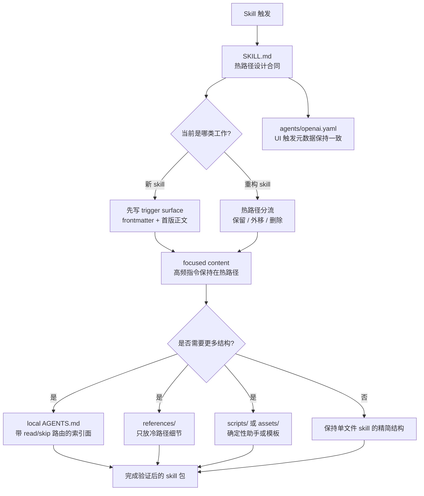

# Skill Write Refactor

[English](./README.md)

这个仓库打包了一个可复用的 Codex skill，用来创建新 skill，或重构已有 skill，同时避免把 `SKILL.md` 写成一个失焦的大杂烩。它的核心设计是把高频热路径保留在主文件里，只有在低频细节真正值得时才外移，并把结构本身当作运行时行为的一部分，而不是事后润色。

## 架构图



## 仓库结构

```text
skill-write-refactor/
  AGENTS.md
  README.md
  README.zh-CN.md
  LICENSE
  .gitignore
  docs/
    USAGE.md
  SKILL.md
  agents/
    openai.yaml
```

## Skill 包内包含什么

- `SKILL.md`：skill 编写与重构的运行时设计合同
- `agents/openai.yaml`：与触发面保持一致的 Codex UI 元数据
- `AGENTS.md`：已发布仓库的 repo-local 读取顺序与维护边界
- `docs/USAGE.md`：安装步骤、工作顺序、示例提示词

## 核心设计思想

### 1. Focused content 优先于百科式 skill 文件

目标不是“写更多文档”，而是让 skill 在真实运行时依然容易触发、容易遵守。

- 热路径只保留高频动作。
- 在增加结构之前，先删掉模板废话、失效说明和模型本来就知道的泛化建议。
- 评价标准是“下一次 agent 运行是否更容易执行”，而不是“人类手册是否更完整”。

### 2. 有意区分 hot path 和 cold path

`SKILL.md` 就是 hot path。它应该承载 agent 在真实工作中反复会用到的内容：

- trigger wording
- primary workflow
- read-when / skip-when routing
- invariants 与 edge checks

只有当低频内容真实存在、确实有用、并且足以证明拆分值得时，才应该把它移出主文件。

### 3. 把 `AGENTS.md` 当作 index surface，而不是第二本手册

当 skill 不再适合单文件时，local `AGENTS.md` 应该承担路由职责：

- 声明 authority 文件
- 定义 read order
- 明确什么时候要读长文件，什么时候可以跳过

它不应该变成主 skill 的陈旧副本。

### 4. 明确写出 read-when / skip-when 路由

可选材料必须“容易不去读”。每个非核心文件都应该有明确的加载条件和明确的跳过条件。这不是写作偏好，而是运行时上下文控制机制。

### 5. 把 method、action、boundary 绑在一起

这个 skill 认为只讲抽象方法是不够的。每个关键流程块都应该回答：

- 这一块要达成什么
- agent 下一步具体该做什么
- 什么时候适用，什么时候该跳过或升级处理

这样指导才既可执行，也不会在边界上引发松散推断。

### 6. 把 soft preference 和 hard rule 放在同一决策点

严格约束和相邻偏好要一起出现：

- `Hard:` 写必须满足的规则
- `Soft:` 写默认偏好、启发式或倾向

这样 agent 在决策时不需要跨多个文件拼规则。

### 7. 用“刻意重复”做 binding

有些重复是值得付成本的，因为它能提高遵从率：

- 在真正执行该步骤的位置重提脆弱边界
- 在被管理的文件旁边重提关键路由规则
- 在热路径开头再次强化 trigger wording

这个 skill 反对那种只会增加字数负担的重复。

### 8. 把 trigger wording 当成注意力控制

description 行和 `SKILL.md` 顶部本身就是注意力控制面：

- skill 容易漏触发时就把它写得更尖锐
- skill 容易过度触发时就把边界收紧
- 短提醒应放在最容易漂移的决策点，而不是到处撒

这是一种注意力控制策略，不是写作风格装饰。

### 9. 用 maintenance-threshold thinking 决定是否拆分

拆分应该由维护压力驱动，而不是由审美驱动。

- 当冷路径细节开始遮挡热路径，或冷分支数量明显增加时，再创建 `references/`
- 当多文件开始需要稳定路由时，再添加 local `AGENTS.md`
- 当同一个确定性辅助逻辑被反复重写时，再提取 `scripts/`
- 当文件不再值得其认知成本时，应该合并或删除

底层原则是：一旦反复出现 drift、ambiguity 或 scan cost，就用更紧的结构来回应。

## 适用场景

当工作对象是 Codex skill 本身时，就适合使用这个 skill，尤其是以下情况：

- 从清晰的 trigger surface 出发创建新 skill
- 在不破坏原有 trigger boundary 的前提下重构已有 skill
- 拆分高频指导和低频参考
- 设计或收紧 local `AGENTS.md` 的路由职责
- 改写 frontmatter description 或 `agents/openai.yaml` 元数据
- 在保留少量必要重复提醒的前提下，压缩 skill 膨胀

如果只是普通代码重构，而不是 skill 设计工作，就不应该用它。

## 安装

### 作为全局 Codex skill 安装

把这个仓库里的 skill 文件复制到：

```text
<CODEX_HOME>/skills/skill-write-refactor/
```

### 作为项目级本地 skill 安装

把同一批文件复制到：

```text
<repo>/.agents/skills/skill-write-refactor/
```

## 使用

工作顺序、示例提示词和打包说明见 [docs/USAGE.md](./docs/USAGE.md)。

## 说明

- 当前打包版本仍然把 `SKILL.md` 保持为单一热路径流程文件。
- 这个仓库包含 local `AGENTS.md`，因为发布后的 repo-level 表面已经足够大，值得显式声明读取顺序和维护路由。
- 只要 trigger scope、tone 或 default prompt 发生变化，就应该同步刷新 `agents/openai.yaml`。
